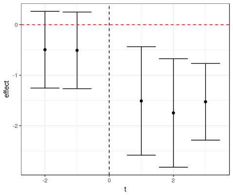

# rAutor
R package for creating the proper lead/lead terms for complex difference-in-differences designs. By complex, we mean cases when changes in the independent variable might come at different times for different observational units and be of different magnitudes (e.g., states changing their minimum wages by different amounts, with changes not coordinated across units). The paper is motivated by [Autor (2003)](https://economics.mit.edu/files/589)---and particular Figure 3 from that paper. [Hall, Horton and Knoeple (2018)](http://www.john-joseph-horton.com/papers/uber_price.pdf) use this code in analyzing the effects of city-specific fare changes on Uber. 

The package has three user-facing functions: 
1. `GenFormula` which creates an R formula with the right specification of lead and lag indicators.
1. `AddIndicators` which populates a data.frame with the lead and lag indicators needed. 
1. `ExtractCoef` that extracts the coefficients from a regression model in gives by-time period effects (work-in-progress) 

# How you use it
Suppose you have a city-week panel, like so, with 6 time periods and two cities, A and B. Also suppose we have some variable 
the can change week to week, in our case, price. 

```
   city week price
1     A    1     1
2     A    2     1
3     A    3     1
4     A    4     0
5     A    5     0
6     A    6     0
7     B    1     2
8     B    2     2
9     B    3     2
10    B    4     2
11    B    5     2
12    B    6     2
```

City A experiences a fare reduction, with the price going from 1 to 0 at the transition from week 3 to 4. 
We could estimate the effect of the price change on some outcome `y` with a regression of the form 
```
y ~ price + factor(city) + factor(week)
```
Althouh a good first start, this regression ignores any of the by-week adjustments and does not allow us to look for parallel trends. 

## Generating lead/lead formulas 
Suppose we want to see what the effect of a fare reduction is one week after a cut and whether it is diferent from the "long run" effect.
We want to run a regression of the form 
```
y ~ price + I(price - price.lag.1):t1"
```
where the `price.lag.1` is the price one time period back and `t1` is in indicator that the observation is occurring one period after the change. The `I(price - price.lage.1)` term is the size of the change. 
To compute the by-week effects, we can add the coefficient on `price` to the coefficient on the "difference" term. 
We might also want to examine the pre-period,  
```
y ~ price + I(price.lead.1-price):tn1 + I(price - price.lag.1):t1"

```
where `tn1` is an indicator that the obeservation is occurring one period before the change. 
For large numbers of leads and lags, this can get tedious, and so the `rAutor` package offers `GenFormula`. 
For the second example, we can simple use 
```
> GenFormula("price", num.periods.pre = 1, num.periods.post = 1)
[1] "~ price + I(price.lead.1-price):tn1 + I(price - price.lag.1):t1"
>
```
We can also avoid doing the lead/lag calculation in the fomrmula by using the `delta.version` flag.
 ```
> GenFormula("price", 1,1, delta.version = TRUE)
[1] "~ price + price.lead.delta.1:tn1 + price.lag.delta.1:t1"
```


## Generating indicators 

To generate the indicators, we can simply use the `rAutor` AddIndicators function (here shown with 2 leads and 2 lags) around the city A fare change:  
```
   city   week price      y    t1 price.lag.1    t2 price.lag.2   tn2 price.lead.2   tn1 price.lead.1
   <fct> <dbl> <dbl>  <dbl> <dbl>       <dbl> <dbl>       <dbl> <dbl>        <dbl> <dbl>        <dbl>
 1 A      1.00  1.00 -0.463  0          NA     0          NA     0            1.00  0            1.00
 2 A      2.00  1.00 -0.204  0           1.00  0          NA     1.00         0     0            1.00
 3 A      3.00  1.00 -0.557  0           1.00  0           1.00  0            0     1.00         0   
 4 A      4.00  0     0.608  1.00        1.00  0           1.00  0            0     0            0   
 5 A      5.00  0     0.392  0           0     1.00        1.00  0           NA     0            0   
 6 A      6.00  0     0.163  0           0     0           0     0           NA     0           NA   
 7 B      1.00  2.00 -1.43   0          NA     0          NA     0            2.00  0            2.00
 8 B      2.00  2.00 -1.05   0           2.00  0          NA     0            2.00  0            2.00
 9 B      3.00  2.00 -1.75   0           2.00  0           2.00  0            2.00  0            2.00
10 B      4.00  2.00 -1.03   0           2.00  0           2.00  0            2.00  0            2.00
11 B      5.00  2.00 -1.83   0           2.00  0           2.00  0           NA     0            2.00
12 B      6.00  2.00 -1.40   0           2.00  0           2.00  0           NA     0           NA     
```
Note that lags and leads that overrun the grouping are NA and if these are interacted with the time indicator, this term will also be NA and the observation will be dropped. In case we want to still use these observations in the regression, `AddIndicators` also adds variables for the difference directly, with missing `NA` values for the difference with 0. To use this feature, pass `delta.version = TRUE` to `GenFormula`. 

## Extracting coefficients 

Typically, we want to plot the estimated per-period effects around the change. 
The regression coefficients we obtain from the fitted model do not directly correspond to what we are lookging for---in a nutshell, each per-period indicator coefficient is the difference from whatever the long-run effect is in that period. 
To extract the coefficeints, you can use the the `ExtractCoef` function. Note that this function expects the model to be fit with felm or plm and so there is no intercept term in `coef(m)`.  
It is probably easiest to just see how it works by example. 
First, I construct the data set and create an outcome, `y` which is a unform random minus the price. 

```
set.seed(1234)
df <- data.frame(
  city = c("A", "A", "A", "A", "A", "A", "B", "B", "B", "B", "B", "B"),
  week  =   c(1,     2,   3,   4,  5,   6,   1,   2,   3,   4,   5,   6),
  price  =   c(1,     1,   1,   0,  0,   0,   2,   2,   2,   2,   2,   2)
)
df$y <- runif(nrow(df)) - df$price
```
Next, we add indicators for 2 leads and 2 lags and construct the formula, with a city-specific fixed effects:
```
df <- AddIndicators(df, 2,2,"price", "city")
formula <- as.formula(paste0("y", GenFormula("price", 2,2, delta.version = TRUE),
           "|city|0|0"))
 ```
Then we estimate the model using `lfe` package and extract the coefficients: 
```
m <- lfe::felm(formula, data = df)
df.effects <- ExtractCoef(m, 2, 2, felm.model = T)
```

We can then plot the effects
```
g <- ggplot(data = df.effects, aes(x = t, y = effect)) + geom_point() +
  geom_errorbar(aes(ymin = effect - 2*se, ymax = effect + 2*se)) +
  geom_point() +
  geom_hline(yintercept = 0, colour = "red", linetype="dashed") +
  geom_vline(xintercept = 0, linetype = "dashed") +
  theme_bw()
print(g)
```
As expected, the estimated treatment effect is close to -1: 


